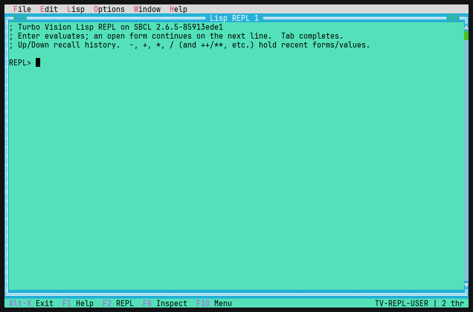
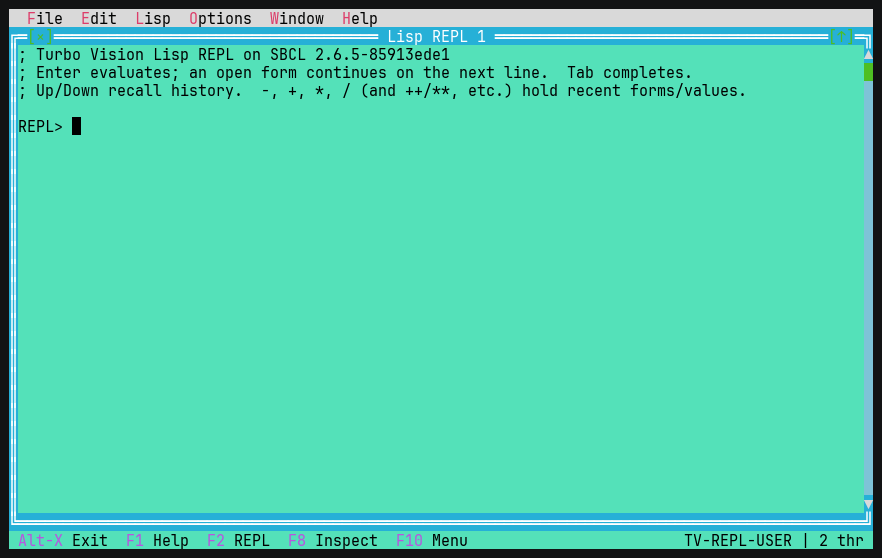
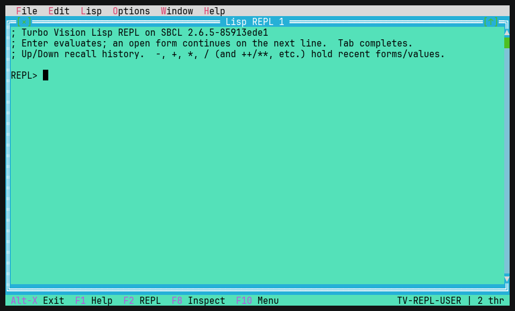
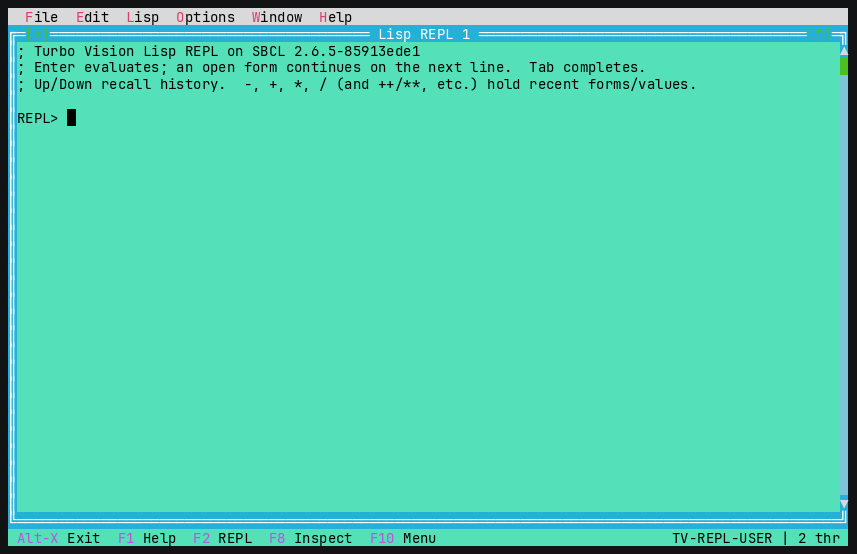
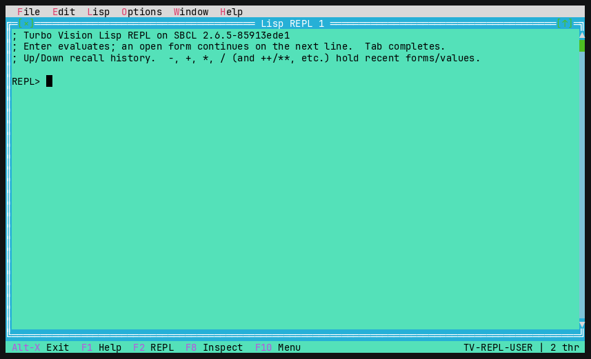
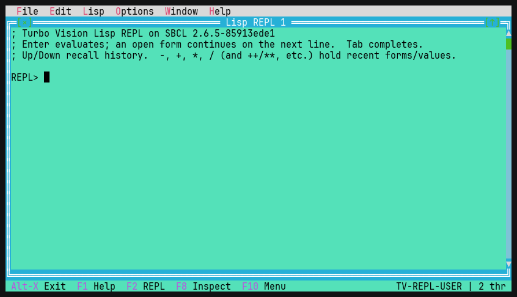

# Turbo Vision for Common Lisp

A port of Borland's [Turbo Vision](https://en.wikipedia.org/wiki/Turbo_Vision)
character-mode UI framework to Common Lisp (SBCL).  It gives you overlapping
movable windows, dialogs, controls, a mouse-aware event system and a DOS-style
colour/palette model — all rendered with ANSI escape sequences in any modern
terminal.

```
▒▒▒▒╔═[×]════════════ Window 1 ════════════[↑]═╗▒▒▒▒▒
▒▒▒▒║  This is window number 1.                ║▒▒▒▒▒
▒▒▒▒║  Drag the title bar to move me.          ║▒▒▒▒▒
▒▒▒▒║      Greet           About               ║▒▒▒▒▒
▒▒▒▒╚══════════════════════════════════════════╝▒▒▒▒▒
 Alt-X Exit  F2 New  F3 About  F4 Greet  F5 Tile  ...
```

## Requirements

* [SBCL](http://www.sbcl.org/)
* A POSIX terminal with `stty` (macOS / Linux)
* No external Lisp libraries — the framework depends only on SBCL itself.  The
  threaded REPL / debugger / tooling use SBCL's own facilities (`sb-thread`,
  `sb-mop`, `sb-di`, and the `sb-introspect` contrib, all bundled with SBCL).

The project is structured to be loadable through [ocicl](https://github.com/ocicl/ocicl):
the current directory is on the ASDF source registry (configured by ocicl in
`~/.sbclrc`), so `(asdf:load-system :tvision)` just works.  Because there are no
third-party dependencies there is nothing to `ocicl install`; `systems.csv` is
kept as a placeholder for any dependencies you add later.

## Running the demo

```sh
./run-demo.sh
# or:
sbcl --script run.lisp
```

### Text editor example

A full multi-window text editor lives in its own system:

```sh
sbcl --eval '(asdf:load-system :tvision/examples/textedit)' \
     --eval '(tvision-textedit:main)'                       \
     --eval '(quit)'
# or open files directly from Lisp:
#   (tvision-textedit:edit-file "a.txt" "b.txt")
```

It has the classic feature set: **New / Open… / Save / Save As… / Close** with
"save changes?" prompts, **Undo/Redo**, **Cut/Copy/Paste/Select-All**,
**Find / Find-Next / Replace / Goto-Line** (with case-sensitive / whole-word /
backward options and interactive or replace-all replacement), an
**Insert/Overwrite** toggle, a
**line:col / modified / INS-OVR indicator** in each window's frame, multiple
editor windows, **Tile/Cascade**, and a **file open/save dialog** (directory
browser: single-click a `dir/` to enter it, `..` to go up, double-click or Enter
a file to open).  Keys: F2 save, F3 open, F7 find, F5 find-next, F8 replace, F6 goto,
F9 next window, Ctrl-Z/Y undo/redo, Ctrl-X/C/V clipboard, Ctrl-A select-all,
Ctrl+Left/Right word movement, Shift+arrows select, F10 menu, Alt-X exit.

### tvlisp — a Lisp REPL / mini-IDE

`tvlisp` is a dedicated Lisp environment built on the framework.  It uses an
in-process, micros-style backend (the same operation set Lem gets from micros,
but built directly on SBCL built-ins with zero external deps), so the running
TUI *is* the Lisp image being driven.

**REPL core**

- **Threaded evaluation (one worker thread per listener).** Each REPL window
  evaluates on its own `sb-thread` worker, so the UI never freezes: output
  streams into the transcript live as it is produced, multiple REPL windows run
  concurrently, and a long/infinite computation can be aborted with **Ctrl-C**
  (Edit ▸ Interrupt eval).  Set `*repl-async*` to nil to force inline evaluation.
- **Tab completion** against the current package; multiple candidates pop up in a
  list, a common prefix is filled in, and `pkg:`/`pkg::` tokens are supported.
- **Per-listener history variables & sticky package.** `*`/`**`/`***`,
  `/`/`//`/`///`, `+`/`++`/`+++` follow standard CL REPL semantics and are kept
  per window (bound with `progv` around evaluation, so concurrent REPLs never
  clobber one another or the global `cl:*`); `(in-package …)` sticks and the
  prompt reflects the current package.
- **Persistent history, transcript, file loading.** Input history is saved to
  `~/.tvlisp_history`; Up/Down recall it, **Ctrl-R** searches it.  File ▸ Load
  file (F7) loads a `.lisp` file with captured output; Save transcript writes the
  buffer; Save/Restore session reopens your REPL windows and their packages.
- **Arglist echo & a live status line.** As you type, the status line shows the
  operator's lambda list (via `sb-introspect`), e.g. `(mapcar function list
  &rest more-lists)`; otherwise it shows the current package, thread count and
  busy state.

**The debugger (SLIME `sldb`-style, across the worker-thread boundary)**

A signalled error pops an "Error — pick a restart" dialog while the worker stays
parked with its stack live:

- Pick a restart to invoke it on the worker's own stack; **`USE-VALUE` /
  `STORE-VALUE`** prompt for a Lisp form so the computation can *resume* past the
  error, not just unwind.  Abort returns to a fresh prompt.
- **Backtrace** opens a frame browser; selecting a frame shows its **local
  variables** (captured live via `sb-di`); selecting a local opens the **object
  inspector** on its value, which you can **drill into** (a `TOutline` tree —
  slots, conses, vectors, hash-table entries, arbitrarily deep).

**Code-intelligence tools (Lisp menu)**

- **Inspect `*`** (F8) or **Inspect expr…** — a `TOutline` tree of any value.
- **Macroexpand**, **Describe**, **Documentation**, **Disassemble** — into
  scrollable windows.
- **Apropos** — type a substring, pick from a type-ahead list, describe it.
- **Class browser** (super/sub-classes + slots via `sb-mop`), **Package
  browser** (switch the current package), **ASDF System browser** (load on
  Enter), **Load buffer** (evaluate an editor window into the REPL).
- **Profiler** — statistical (`sb-sprof`) and deterministic (`sb-profile`).
  Runs on the worker thread so the UI stays live, then shows the results in a
  sortable `TTableView` grid (Self% / Cumul% / Samples / Function — click a
  header or press `s`/`r` to re-sort); **Enter** jumps to a function's source
  and **`g`** opens the call-graph as a `TOutline` tree.



**Editing & windows**

- **Find / Find-next** (Ctrl-F / Ctrl-L) over the transcript, **right-click
  context menu**, **open a file in an editor window** (a `TEditWindow`) via a
  reusable `TFileDialog` — type a path or browse: Enter on a directory descends
  into it, Enter on `..` goes back up, Enter on a file opens it.
- **Options:** theme picker (`TColorDialog`), pretty-print toggle, eval-timing
  toggle (`; N ms`), auto-close parens.
- **Thread monitor** (F9, Window ▸ Threads) lists the worker threads with
  Refresh / Kill; new REPL (F2), Clear (F3), Tile (F4), Cascade (F5), Next (F6),
  Help (F1).
- **HyperSpec browser** (Help ▸ HyperSpec / browse…) — a `THtmlView` hypertext
  control that renders the simple, CSS/JS-free HTML used by references like the
  Common Lisp HyperSpec.  Tab / Shift-Tab move between links, Enter (or a click)
  follows one, and a Back / Forward history is kept — Ctrl-B (or Backspace) goes
  Back, Ctrl-F goes Forward, Ctrl-R reloads (Alt-←/→ work too where the terminal
  sends them).  Help ▸ Browser history pops up the
  visited-page list (current marked) so you can jump straight to any of them.
  Remote pages are fetched with `curl` (no in-image TLS needed); local files
  are read directly.












```sh
make tvlisp && ./tvlisp
# or: sbcl --eval '(asdf:make :tvision/examples/tvlisp)' --quit  (-> ./tvlisp)
# or from Lisp: (asdf:load-system :tvision/examples/tvlisp) (tvision-tvlisp:main)
```

### Standalone executables

```sh
make                 # build all three: ./tvision-demo, ./textedit, ./tvlisp
make textedit        # build just the editor
make tvlisp          # build just the REPL app
make run-demo        # build and launch the demo
make clean           # remove the binaries and this project's fasl cache

# or directly, without make:
sbcl --eval '(asdf:make :tvision/examples)' --quit            # -> ./tvision-demo
sbcl --eval '(asdf:make :tvision/examples/textedit)' --quit   # -> ./textedit  [file...]
sbcl --eval '(asdf:make :tvision/examples/tvlisp)' --quit     # -> ./tvlisp
```

`asdf:make` uses the `program-op`/`build-pathname`/`entry-point` settings in
`tvision.asd` to dump self-contained binaries.  `./textedit file1 file2` opens
those files on startup.

The demo opens a **Lisp REPL** on startup (File ▸ REPL / F2): type a form and
press Enter to evaluate it (an open form continues on the next line), Up/Down
recall history, output is read-only, and `*`/`**`/`***` hold recent values.

Keys in the demo: **F1** help · **F10** menu bar (or **Alt+letter**) · **F2**
REPL · **F7** editor · **F9** scroller · **F8** sample form (Tab/Shift-Tab,
history field, validated field, radio buttons) · **F3** about · **F4** greeting ·
**F5** tile · **F6** cycle windows · **Alt-1..9** select window · **Alt-X** quit ·
**Ctrl-W** close.  The Palette menu switches colour / black-white / monochrome;
File ▸ Save/Load desktop persists windows.  Inside an open menu, arrows or the
highlighted letter choose, Esc cancels.  When no window is open the Tile /
Cascade / Close commands grey out.  **Resize the terminal** and the UI reflows.
In the editor: Shift+arrows select, Ctrl-C/X/V clipboard, Ctrl-Z undo, Tab
inserts spaces.  The mouse works throughout: click/drag a scroll bar, double-
click a list item, drag a title bar, drag the bottom-right corner to resize,
click `[×]`/`[↑]`, and the wheel scrolls.

## Using the library

```lisp
(asdf:load-system :tvision)

(defclass my-app (tv:tapplication) ())

(defmethod tv::setup ((app my-app))
  (let ((w (make-instance 'tv:twindow
                          :title "Hello"
                          :bounds (tv:make-trect 5 3 45 15))))
    (tv:insert w (make-instance 'tv:tstatic-text
                                :text "Hello, Turbo Vision!"
                                :bounds (tv:make-trect 2 2 30 3)))
    (tv:insert (tv:program-desktop app) w)))

(tv:run 'my-app)
```

> Tip: always pass `:bounds` to `make-instance` for windows/dialogs/desktops.
> Their frames and backgrounds are built during construction and need the size
> up front.

## Architecture

The port follows Turbo Vision's design closely.  Each source file maps to a
recognisable part of the original framework:

| File | Turbo Vision analogue | Responsibility |
|------|----------------------|----------------|
| `src/geometry.lisp`    | `TPoint`, `TRect`       | points & rectangles |
| `src/colors.lisp`      | colour attributes, palettes | DOS attribute byte ↔ ANSI SGR, palette chains |
| `src/draw-buffer.lisp` | `TDrawBuffer`           | a run of `char+attribute` cells |
| `src/events.lisp`      | `TEvent`, key/command codes | event record and constants |
| `src/screen.lisp`      | `THardwareInfo`/`TScreen` | raw mode, alternate screen, diff-based ANSI rendering, input decoding (keys + SGR mouse) |
| `src/concurrency.lisp` | (new)                   | `sb-thread` mailbox + worker→UI callback queue and self-pipe wakeup (lets background threads drive the single-threaded UI loop) |
| `src/view.lisp`        | `TView`                 | base class: geometry, state, palette mapping, clipped drawing, events |
| `src/group.lisp`       | `TGroup`                | subview ownership, Z-order, focus, event dispatch, modal exec |
| `src/frame.lisp`       | `TFrame`                | window borders, title, close/zoom icons |
| `src/scrollbar.lisp`   | `TScrollBar`            | proportional scroll bar |
| `src/window.lisp`      | `TWindow`               | framed, movable, closable, zoomable window |
| `src/desktop.lisp`     | `TDesktop`/`TBackground`| background fill, tile/cascade |
| `src/widgets.lisp`     | static text, label, button, input line, check boxes | controls |
| `src/dialog.lisp`      | `TDialog`               | modal dialogs, `message-box`, `input-box` |
| `src/statusline.lisp`  | `TStatusLine`           | bottom hint/shortcut bar |
| `src/program.lisp`     | `TProgram`/`TApplication`| application palette, main event loop, modal loop, window dragging |
| `src/menu.lisp`        | `TMenuBar`/`TMenuBox`/`TMenuPopup` | menu bar, dropdowns, submenus, shortcuts, hot-keys, `popup-menu` (context menus) |
| `src/scroller.lisp`    | `TScroller`             | view onto a virtual area, bound to scroll bars |
| `src/textview.lisp`    | `TEditor`/`TMemo`/`TFileEditor`/`TEditWindow` | editable text area + the windowed/in-dialog editor classes |
| `src/cluster.lisp`     | `TCluster`/`TRadioButtons`/`TCheckBoxes`/`TMultiCheckBoxes` | labelled option clusters (incl. multi-state boxes) |
| `src/validator.lisp`   | `TValidator`/`TLookupValidator` family | filter / range / picture / string-lookup input validators |
| `src/collection.lisp`  | `TCollection`           | dynamic + sorted collections |
| `src/listbox.lisp`     | `TListViewer`/`TListBox`/`TSortedListBox` | scrollable, selectable list (multi-column, type-ahead search) |
| `src/outline.lisp`     | `TOutline`              | collapsible tree view |
| `src/history.lisp`     | `THistory`/`THistoryViewer`/`THistoryWindow` | input line with a recallable value history |
| `src/filedialog.lisp`  | `TFileDialog`/`TFileInputLine`/`TFileInfoPane` | file dialog: directory browser, wildcard filter, size/date pane |
| `src/chdir.lisp`       | `TChDirDialog`/`TDirListBox` | change-directory dialog |
| `src/colordialog.lisp` | `TColorDialog`/`TColorSelector`/`TColorDisplay`/`TMonoSelector` | colour-picker controls with a live sample |
| `src/help.lisp`        | help system / `THelpFile` | hypertext topics with links + navigable viewer |
| `src/persist.lisp`     | streams                 | S-expression save/load of the desktop |
| `src/stream.lisp`      | `TStream`/`TResourceFile` | binary object streaming + named resource files |
| `src/threadmon.lisp`   | (new)                   | refreshable thread monitor (list + kill worker threads) |
| `src/repl.lisp`        | (new)                   | `trepl-view` — threaded Lisp REPL, restart/backtrace/frame-locals debugger, inspector, text windows |

The text view (`src/textview.lisp`) carries the editor engine: selection,
clipboard, undo/redo, insert/overwrite, word movement, goto, find,
`text-replace-all`, file load/save, a `tindicator`, and the read-only "protect"
boundary — enough for both the REPL and the editor example below.

### Key design choices

* **CLOS class hierarchy.**  `tview` → `tgroup` → `twindow`/`tdesktop`/
  `tprogram`, with `draw`, `handle-event`, `get-palette`, `set-state` etc. as
  generic functions, so you extend behaviour by subclassing and specialising —
  the Lisp-idiomatic equivalent of overriding C++ virtual methods.

* **Single back-buffer with z-order compositing.**  Rather than giving every
  group its own buffer, all views write into one screen-sized back buffer.
  Correct layering comes from drawing back-to-front; `flush-screen` then diffs
  the back buffer against what is currently displayed and emits the minimal set
  of ANSI sequences.  Each view computes its absolute origin and a clip
  rectangle by walking the owner chain, so drawing never escapes its container.

* **Palette chains.**  A view maps a small colour *index* through its own
  palette, then up through each owning group's palette, until it reaches the
  application palette which holds the only real attribute bytes.  This is how a
  button gets a different colour in a grey dialog than in a blue window without
  knowing anything about its container — exactly as in Turbo Vision.

* **Self-contained terminal driver.**  Raw mode is set via `stty`, the
  alternate screen and mouse tracking via xterm control sequences, and input is
  read non-blocking from fd 0 and decoded (arrow/function keys, and SGR-encoded
  mouse reports).

## Status / scope

Implemented: views, groups, windows, frames, desktop, dialogs, status line,
pull-down menus (dropdowns/submenus/shortcuts/hot-keys) and **right-click
context menus**, an editable text area
(selection, clipboard, undo, read-only "protect" region), scroller + list box +
collections, clusters/radio-buttons/check-boxes, input validators (filter /
range / picture; **enforced on dialog accept**) and input history, buttons, input
lines, labels, static/param text, scroll bars, modal execution, Tab/Shift-Tab
focus cycling, a command set
(enable/disable with greying), window drag/close/zoom/**resize**/keyboard
move-size/**cycling (F6)**/**Alt-1..9 selection**, **drop shadows**, tiling/
cascading, group-level data exchange, a **tree view (`TOutline`)**, **colour-
picker controls** (`TColorSelector`/`TColorDisplay`/`TMonoSelector`), **per-view
event masks** and **per-control disable/grey**, **hypertext help** (linked
topics) with a context-switched status line, **colour / black-white / monochrome
palettes**, S-expression *and* **binary** persistence (`TResourceFile`), full
mouse (incl. **double/triple-click, wheel, auto-repeat**) and keyboard (incl.
**Alt/Ctrl/Shift modifiers**), configurable cursor shapes, **live terminal
resize**, and a diffing ANSI renderer.

The control set covers essentially all of Borland Turbo Vision's, including the
later additions: **multi-state check boxes**, a **type-ahead sorted list box**, a
**change-directory dialog**, an **in-dialog memo** and the **windowed editor**
classes (`TFileEditor`/`TEditWindow`), **string-lookup validators**, and a
file dialog with **wildcard filtering** and a **size/date info pane**.  Beyond
the original, the port adds a **threaded Lisp REPL** with a SLIME `sldb`-style
debugger (restarts, backtrace, frame-locals, value drill-down) and a **thread
monitor** — built on an `sb-thread` worker model with a worker→UI callback
bridge (`src/concurrency.lisp`).

Deliberately not implemented (invasive core rewrites for little visible gain):
Turbo Vision's per-group buffer + cover-list occlusion model (this port
composites a single back buffer in z-order each frame — correct on screen, just
not the original's partial-repaint optimization); 256-/true-colour (the cell
attribute is a 16-colour DOS byte); editor word-wrap; and the `TColorDialog`
palette-scheme *editor* lists (`TColorGroupList`/`TColorItemList`) — the colour
*picker* controls are present, but editing a whole application palette by colour
group is not.

`Tab`/`Shift-Tab` cycle the focus among a group's controls in layout order
(consumed at the innermost group that holds leaf controls, so the desktop never
cycles windows on Tab).  The command set (`enable-command`, `disable-command`,
`set-command-enabled`, `command-enabled-p`) is consulted by menus, buttons and
status items: disabled commands won't fire (even via their shortcut) and are
drawn greyed out.

`tscroller` shows a window onto a larger virtual area and stays in sync with one
or two `tscrollbar`s (the `cmScrollBarChanged` broadcast moves the view; the view
updates the bars, with a reentrancy guard).  Scroll bars also respond to mouse
clicks (arrows + paging).  The terminal driver installs a `SIGWINCH` handler;
the main loop services it via `apply-resize`, which re-queries the size, resizes
the buffers and reflows the whole view tree through `change-bounds`/grow-modes.

### Text area & the Lisp REPL

`ttext-view` (in `src/textview.lisp`) is a full multi-line editor: line storage,
cursor movement, scrolling, insert/delete/split, selection, clipboard, undo, a
read-only "protect" boundary, and an `append-text` method for streaming output.
The Enter key is routed through the generic `text-return`.

`trepl-view` (in `src/repl.lisp`) is a working Lisp REPL built on exactly those
hooks: it overrides `text-return` to read the text after the prompt, evaluate it
in a dedicated `TV-REPL-USER` package (capturing printed output and binding the
history variables), `append-text` the values back, and write a fresh prompt —
while `set-protect-boundary` keeps the transcript above the prompt read-only.  An
incomplete form (unbalanced parens) continues on the next line instead of
evaluating, and Up/Down recall input history.  `(make-repl-window bounds)`
returns a ready-to-insert window with the REPL and a scroll bar.  Evaluation runs
on a per-listener `sb-thread` worker; the worker→UI bridge in
`src/concurrency.lisp` streams output and drives the cross-thread debugger.  The
**tvlisp** example above turns this into a full mini-IDE.

## Testing

A self-contained, dependency-free test suite (a tiny `deftest`/`ok`/`is=`
harness) drives each control — constructing it, feeding events through
`handle-event`, and asserting on state, data or rendered cells:

```sh
make test                                         # 115 checks across 25 tests
# or:  sbcl --eval '(asdf:test-op :tvision/tests)'
# or from Lisp: (asdf:load-system :tvision/tests) (tvision-tests:run-tests)
```

It exits non-zero on any failure (CI-ready) and covers geometry, the draw
buffer, every control (clusters, lists, validators, collections, history,
menus/`TMenuPopup`, colour selectors, file/chdir dialogs, the memo/editor), the
concurrency mailbox, the thread monitor, and the REPL backend.

## License

MIT.
