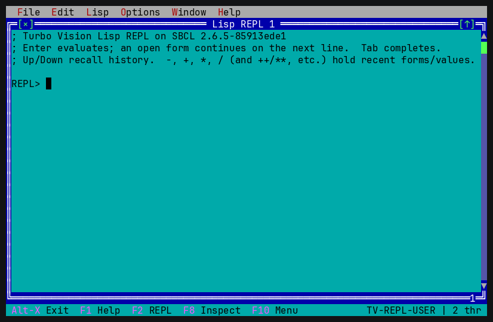
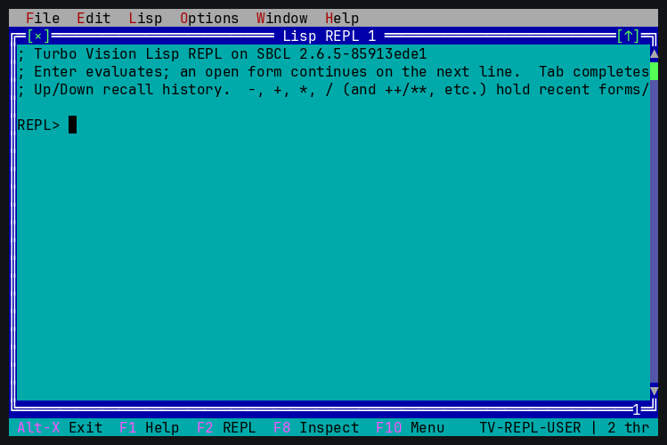
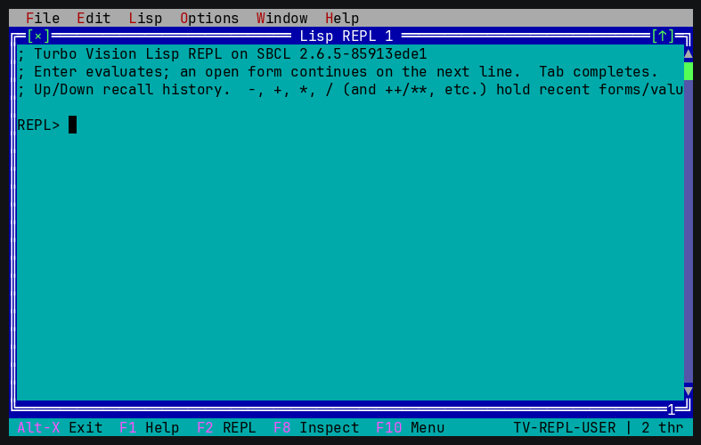
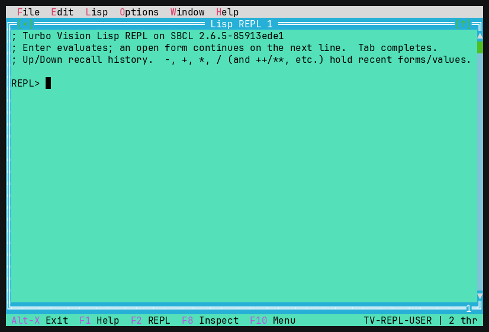
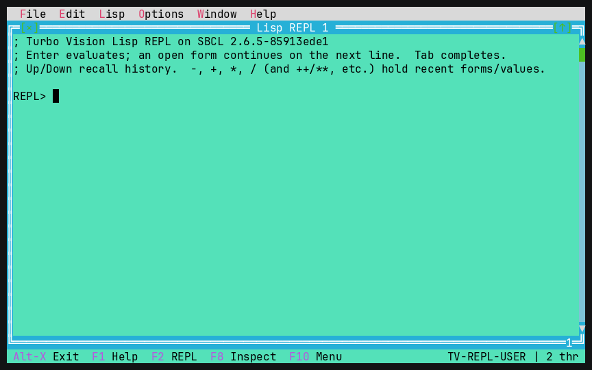
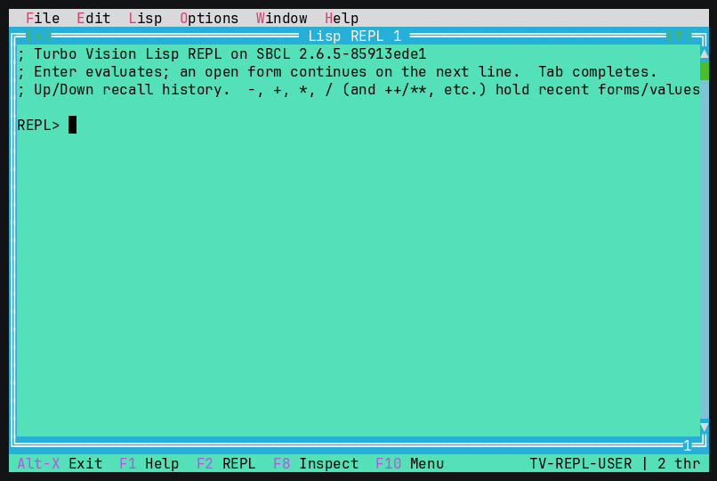
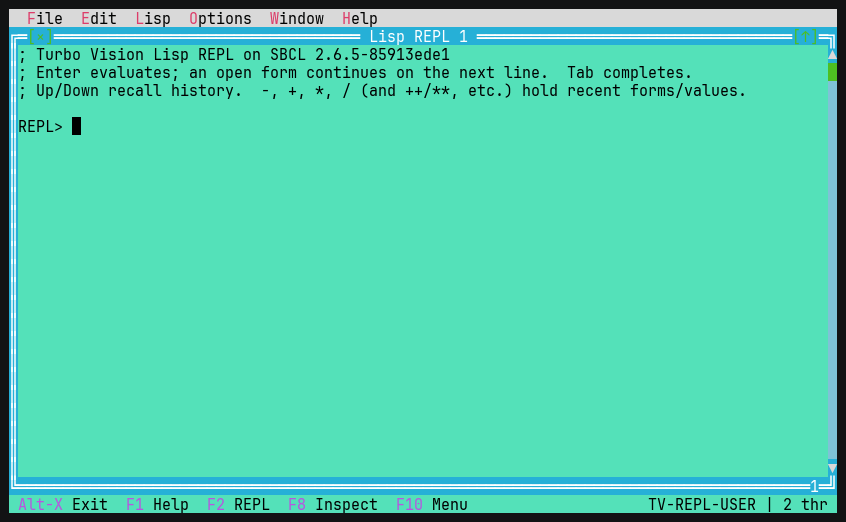
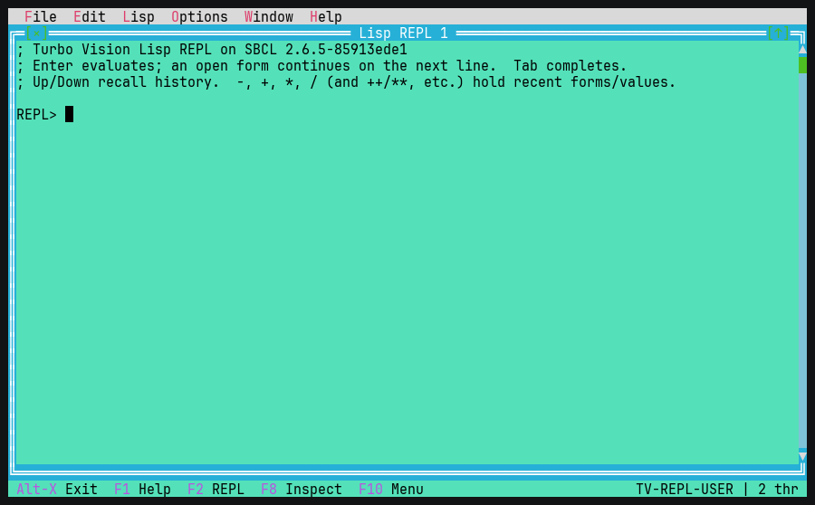
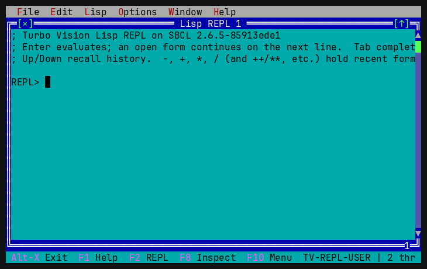

# Turbo Vision for Common Lisp

A port of Borland's [Turbo Vision](https://en.wikipedia.org/wiki/Turbo_Vision)
character-mode UI framework to Common Lisp (SBCL).  It gives you overlapping
movable windows, dialogs, controls, a mouse-aware event system and a DOS-style
colour/palette model — all rendered with ANSI escape sequences in any modern
terminal.  Views draw in the classic 4-bit palette, but the renderer resolves
it through a **24-bit RGB theme** and matches the terminal automatically
(true-colour → xterm-256 → 16-colour), so colours are exact and themeable — and
a view can also paint **arbitrary per-cell true colour** (`make-rgb`) when it
wants a gradient or image.

```
▒▒▒▒╔═[×]════════════ Window 1 ════════════[↑]═╗▒▒▒▒▒
▒▒▒▒║  This is window number 1.                ║▒▒▒▒▒
▒▒▒▒║  Drag the title bar to move me.          ║▒▒▒▒▒
▒▒▒▒║      Greet           About               ║▒▒▒▒▒
▒▒▒▒╚══════════════════════════════════════════╝▒▒▒▒▒
 Alt-X Exit  F2 New  F3 About  F4 Greet  F5 Tile  ...
```







## Requirements

* [SBCL](http://www.sbcl.org/)
* A POSIX terminal with `stty` (macOS / Linux)
* No external Lisp libraries to **build or run** — the framework and the example
  binaries depend only on SBCL itself.  The threaded REPL / debugger / tooling
  use SBCL's own facilities (`sb-thread`, `sb-mop`, `sb-di`, and the
  `sb-introspect` contrib, all bundled with SBCL).
* Running the **test suite** additionally needs [FiveAM](https://github.com/lispci/fiveam)
  (a test-only dependency).  It is pinned in `systems.csv`, so `ocicl` restores
  it (and its deps) on a fresh checkout; with Quicklisp use `ql:quickload :fiveam`.

The project is structured to be loadable through [ocicl](https://github.com/ocicl/ocicl):
the current directory is on the ASDF source registry (configured by ocicl in
`~/.sbclrc`), so `(asdf:load-system :tvision)` just works.  Because there are no
third-party dependencies there is nothing to `ocicl install`; `systems.csv` is
kept as a placeholder for any dependencies you add later.

## Running the example

The port ships with **`tvlisp`**, a Lisp REPL / mini-IDE that exercises the
whole framework — overlapping windows, menus, dialogs, the editor, the object
inspector, an HTML browser, and more.

```sh
make tvlisp && ./tvlisp
```

### tvlisp — a Lisp REPL / mini-IDE

`tvlisp` is a dedicated Lisp environment built on the framework.  It uses an
in-process, micros-style backend (the same operation set Lem gets from micros,
but built directly on SBCL built-ins with zero external deps), so the running
TUI *is* the Lisp image being driven.

**REPL core**

- **Threaded evaluation (one worker thread per listener).** Each REPL window
  evaluates on its own `sb-thread` worker, so the UI never freezes: output
  streams into the transcript live as it is produced, multiple REPL windows run
  concurrently, and a long/infinite computation can be aborted with **Ctrl-C**
  (Edit ▸ Interrupt eval).  Set `*repl-async*` to nil to force inline evaluation.
- **Tab completion** against the current package; multiple candidates pop up in a
  list, a common prefix is filled in, and `pkg:`/`pkg::` tokens are supported.
  When nothing prefix-matches it falls back to **fuzzy (flex) completion** —
  `mvb` → `multiple-value-bind` — ranked by word-boundary alignment.
- **Per-listener history variables & sticky package.** `*`/`**`/`***`,
  `/`/`//`/`///`, `+`/`++`/`+++` follow standard CL REPL semantics and are kept
  per window (bound with `progv` around evaluation, so concurrent REPLs never
  clobber one another or the global `cl:*`); `(in-package …)` sticks and the
  prompt reflects the current package.
- **Persistent history, transcript, file loading.** Input history is saved to
  `~/.tvlisp_history`; Up/Down recall it, **Ctrl-R** searches it.  File ▸ Load
  file (F7) loads a `.lisp` file with captured output; Save transcript writes the
  buffer; Save/Restore session reopens your REPL windows and their packages.
- **Arglist echo & a live status line.** As you type, the status line shows the
  operator's lambda list (via `sb-introspect`), e.g. `(mapcar function list
  &rest more-lists)`; otherwise it shows the current package, thread count and
  busy state.
- **Presentations.** Every value the REPL prints is a live object, not just
  text: **double-click a result** to open the inspector on the actual object and
  drill into its structure (SLY-style).

  

**The debugger (SLIME `sldb`-style, across the worker-thread boundary)**

A signalled error pops an "Error — pick a restart" dialog while the worker stays
parked with its stack live:

- Pick a restart to invoke it on the worker's own stack; **`USE-VALUE` /
  `STORE-VALUE`** prompt for a Lisp form so the computation can *resume* past the
  error, not just unwind.  Abort returns to a fresh prompt.
- **Backtrace** opens a frame browser built for reading.  It **hides
  debugger/runtime machinery** by default (the signalling chain, the evaluator,
  the worker loop), shows the **condition** in its header, and **marks (►) and
  focuses** the frame that *signalled* the error; **`a`** toggles the full stack.
  Each row is a **call form with its arguments** — e.g. `(parse "oops")`, via
  `sb-debug`'s `frame-call` — followed by a **`file:line`** locator.  **`/`** and
  **`n`** search the stack.

  

- **Inline locals.** Press Enter on a frame to expand its **local variables**
  (captured live via `sb-di`) right under it; Enter on a local opens the **object
  inspector** on its value, which you can **drill into** (a `TOutline` tree —
  slots, conses, vectors, hash-table entries, arbitrarily deep).

  

- **Frame ops** in the backtrace browser:
  - **`r`** *returns from the frame* — unwind the worker's live stack to that
    frame and make it return a value you type (`sb-debug`'s
    `unwind-to-frame-and-call`), so you can step past a bad call without
    restarting the computation.
  - **`c`** *restarts the frame* — unwind to it and re-run it with the same
    arguments (best-effort; arguments can be optimized away).
  - **`v`** *views the source* — jump to the frame's definition in an editor.
  - **`d`** *disassembles* the frame's own (live) function — works for methods,
    closures and anonymous code, not just named functions.
  - **`x`** *evaluates a form in the frame* — with the frame's locals bound.

  

  

  

**Code-intelligence tools (Lisp menu)**

- **Inspect `*`** (F8) or **Inspect expr…** — a `TOutline` tree of any value;
  Enter (or `i`) on a node drills into that value (re-rooting in place, with a
  breadcrumb), **Backspace** goes back and **`f`** goes forward again, and `g`
  jumps to its definition (for symbols, classes and named functions).

  

  Inspecting a **symbol** shows its whole namespace — name, home package, value,
  function / macro / special-operator, the class it names, plist and
  documentation — each cell drillable:

  
- **Macroexpand** — an interactive macro stepper (Emacs `macrostep` /
  SLIME-style).  The form is navigable: put the cursor on **any** subform and
  expand *just that macro, in place* (`e`), so the surrounding code stays put and
  reads as ordinary source.  `Tab` jumps to the next expandable position, `m`
  fully expands the subform, `M` expands every macro in the form
  (`sb-cltl2:macroexpand-all`), `u` undoes and `0` resets, and `o`/`c` send the
  result to an editor / the clipboard.

  

  

- **Describe**, **Documentation**, **Disassemble** — into scrollable windows.
- **Trace / Untrace** — toggle `trace` on a function (output streams into the
  REPL as it is called); Untrace-all lists and clears the traced set.
- **Call tree** (Lisp ▸ Profile/trace ▸ Call tree) — *watch* functions
  (`sb-int:encapsulate`) so every call/return is recorded with its **live** args
  and result, shown as a depth-indented tree; each row is a presentation (Enter
  inspects the arguments or the result).
- **Break on entry** (Lisp ▸ Profile/trace) — arm a function so its next call
  stops in the cross-thread debugger (navigable backtrace + frame ops; CONTINUE
  resumes).  `(break)`, `cerror` and `invoke-debugger` route there too.
- **Cross-reference** (Lisp ▸ Navigate) — who **calls / references / binds / sets
  / macroexpands** a symbol, in one navigable results window (Enter jumps to the
  site); plus go-to-definition with an **Alt-,** pop-back stack.
- **Apropos** — type a substring, pick from a type-ahead list, describe it.
- **Class browser** — a type-ahead list of every class; OK / Enter jumps to the
  selected class's definition, Inspect opens it in the object inspector.
- **Package browser** — a type-ahead list; OK / Enter switches the listener's
  current package, Inspect opens the package in the inspector.
- **ASDF System browser** (load on Enter), **Load buffer** (evaluate an editor
  window into the REPL).
- **HyperSpec lookup** — opens the browser on the Common Lisp HyperSpec page
  for the symbol at the cursor (resolved via the HyperSpec's `Map_Sym.txt`);
  prompts, prefilled, when there is no symbol or it is not a standard one.
- **Profiler** — statistical (`sb-sprof`) and deterministic (`sb-profile`).
  Runs on the worker thread so the UI stays live, then shows the results in a
  sortable `TTableView` grid (Self% / Cumul% / Samples / Function — click a
  header or press `s`/`r` to re-sort); **Enter** jumps to a function's source
  and **`g`** opens the call-graph as a `TOutline` tree.


**Editing & windows**

- **Lisp syntax highlighting** in editor windows — comments, strings, `#\chars`
  and `:keywords` are coloured, and the paren matching the one at the cursor is
  highlighted.  **Auto-indent** follows Emacs `cl-indent`: per-operator specs
  give each form's distinguished arguments a deeper indent and the body two
  columns, ordinary calls align under their first argument, binding/literal and
  quoted/backquoted lists align under their first element, `loop` clauses align
  under the first clause (a `when`/`if` clause body indents two further), and
  user macros with a `&body` argument are indented like special forms (looked up
  live in the image).  **Tab** re-indents the current line (or the
  selected lines) — or, when the cursor follows a symbol, **completes** it (see
  below); **Alt-Q** re-indents the whole top-level form.  **Undo /
  redo** (Ctrl-Z / Ctrl-Y).




- **Eval from an editor** — Lisp ▸ Eval defun (the top-level form at the cursor)
  and Eval region (the selection) submit into a REPL.
- **Compile with navigable notes** (SLIME `C-c C-c`) — Lisp ▸ Compile defun (the
  form at the cursor) or Compile buffer compiles *without loading* and lists the
  compiler warnings/notes in a window; **Enter on a note jumps to the offending
  source** (located precisely by matching the symbol named in the message).

  

- **Symbol completion in editor buffers** — **Tab** after a symbol prefix
  completes it against the buffer's package (a popup picker for multiple
  candidates), reusing the REPL's completion backend.

  

- **Comment region** (Edit ▸ Comment region) toggles `;;` over the selected lines
  or the current line.
- **Structural editing** (Edit ▸ Structural) — paredit-style **wrap** the form at
  the cursor in `()`, **splice** (remove the enclosing parens), **raise** (replace
  the enclosing form with the one at point), and **slurp / barf forward** (the
  form absorbs the next sexp / expels its last one).
- **Rename symbol** (Edit ▸ Rename symbol) — whole-token rename across every open
  editor buffer, with a preview of the occurrences and a confirm before applying.
- **Insert template** (Edit ▸ Insert template) — `defun` / `defclass` /
  `defmethod` / `loop` / `handler-case` / … skeletons, indented to the cursor.
- **Go-to-definition pop-back** — **Alt-.** jumps to a definition; **Alt-,** pops
  back to where you came from (a navigation stack across jumps).
- **Find / Find-next** (Ctrl-F / Ctrl-L) in the focused REPL transcript *or
  editor window*, with **case-sensitive / whole-word / backward** options, plus
  **Replace** — all-at-once or **query-replace** (confirm each match).
  **Incremental search** (type-to-jump, Down for next), **Go to line**, and a
  **word-wrap** toggle round out the editor.

  

  

  **Right-click context menu**,
  **open a file in an editor window** (a `TEditWindow`) via a
  reusable `TFileDialog` — type a path or browse: Enter on a directory descends
  into it, Enter on `..` goes back up, Enter on a file opens it.
- **Options:** theme picker (`TColorDialog`), pretty-print toggle, eval-timing
  toggle (`; N ms`), auto-close parens.
- **Thread monitor** (F9, Window ▸ Threads) lists the worker threads with
  Refresh / Kill; new REPL (F2), Clear (F3), Tile (F4), Cascade (F5), Next (F6),
  Close (Window ▸ Close), Help (F1).
- **Numbered windows** — each window is assigned the lowest free number 1–9
  (shown in its frame, classic TV style); **Alt-1…9** jumps straight to that
  window.
- **Zoom** (F5) toggles the active window between its size and the full desktop;
  **Size/Move** (Ctrl-F5) enters interactive keyboard move (arrows) / resize
  (Shift+arrows), Enter or Esc to finish.
- **Window list** (Window ▸ List, Alt-0) — a picker of every open window
  (numbered, the active one marked); Enter / OK raises and focuses the chosen
  window, like the classic Turbo Vision IDE's Alt-0.
- **Close** (Window ▸ Close) closes the active window; a modified editor first
  prompts Save / Discard / Cancel so you don't lose unsaved changes — and for a
  never-saved buffer, choosing Save brings up the Save As dialog.




- **HyperSpec browser** (Help ▸ HyperSpec / browse…) — a `THtmlView` hypertext
  control that renders the simple, CSS/JS-free HTML used by references like the
  Common Lisp HyperSpec.  Tab / Shift-Tab move between links, Enter (or a click)
  follows one, and a Back / Forward history is kept — Ctrl-B (or Backspace) goes
  Back, Ctrl-F goes Forward, Ctrl-R reloads (Alt-←/→ work too where the terminal
  sends them).  `/` searches the page (find-in-page) with `n` / `N` to jump
  between highlighted hits.  Help ▸ Browser history pops up the
  visited-page list (current marked) so you can jump straight to any of them.
  Remote pages are fetched with `curl` (no in-image TLS needed); local files
  are read directly.


`TLabel`s carry the classic mnemonic: the accented letter in `~N~ame` / `~F~iles`
is an Alt-hotkey (and a click target) that moves focus to the linked control, so
Alt-N jumps to the filename field and Alt-F to the browser.


```sh
make tvlisp && ./tvlisp
# or: sbcl --eval '(asdf:make :tvision/examples/tvlisp)' --quit  (-> ./tvlisp)
# or from Lisp: (asdf:load-system :tvision/examples/tvlisp) (tvision-tvlisp:main)
```

### Standalone executable

```sh
make                 # build ./tvlisp
make clean           # remove the binary and this project's fasl cache

# or directly, without make:
sbcl --eval '(asdf:make :tvision/examples/tvlisp)' --quit     # -> ./tvlisp
```

`asdf:make` uses the `program-op`/`build-pathname`/`entry-point` settings in
`tvision.asd` to dump a self-contained binary.

The mouse works throughout: click/drag a scroll bar, double-click a list item,
drag a title bar, drag the bottom-right corner to resize, click `[×]`/`[↑]`, and
the wheel scrolls.  **F10** opens the menu bar (or **Alt+letter**), **Alt-1..9**
select a window, **Alt-X** quits, and **resizing the terminal** reflows the UI.

## Using the library

```lisp
(asdf:load-system :tvision)

(defclass my-app (tv:tapplication) ())

(defmethod tv::setup ((app my-app))
  (let ((w (make-instance 'tv:twindow
                          :title "Hello"
                          :bounds (tv:make-trect 5 3 45 15))))
    (tv:insert w (make-instance 'tv:tstatic-text
                                :text "Hello, Turbo Vision!"
                                :bounds (tv:make-trect 2 2 30 3)))
    (tv:insert (tv:program-desktop app) w)))

(tv:run 'my-app)
```

> Tip: always pass `:bounds` to `make-instance` for windows/dialogs/desktops.
> Their frames and backgrounds are built during construction and need the size
> up front.

## Architecture

The port follows Turbo Vision's design closely.  Each source file maps to a
recognisable part of the original framework:

| File | Turbo Vision analogue | Responsibility |
|------|----------------------|----------------|
| `src/geometry.lisp`    | `TPoint`, `TRect`       | points & rectangles |
| `src/colors.lisp`      | colour attributes, palettes | DOS attribute byte ↔ ANSI SGR, palette chains |
| `src/draw-buffer.lisp` | `TDrawBuffer`           | a run of `char+attribute` cells |
| `src/events.lisp`      | `TEvent`, key/command codes | event record and constants |
| `src/screen.lisp`      | `THardwareInfo`/`TScreen` | raw mode, alternate screen, diff-based ANSI rendering, input decoding (keys + SGR mouse) |
| `src/concurrency.lisp` | (new)                   | `sb-thread` mailbox + worker→UI callback queue and self-pipe wakeup (lets background threads drive the single-threaded UI loop) |
| `src/view.lisp`        | `TView`                 | base class: geometry, state, palette mapping, clipped drawing, events |
| `src/group.lisp`       | `TGroup`                | subview ownership, Z-order, focus, event dispatch, modal exec |
| `src/frame.lisp`       | `TFrame`                | window borders, title, close/zoom icons |
| `src/scrollbar.lisp`   | `TScrollBar`            | proportional scroll bar |
| `src/window.lisp`      | `TWindow`               | framed, movable, closable, zoomable window |
| `src/desktop.lisp`     | `TDesktop`/`TBackground`| background fill, tile/cascade |
| `src/widgets.lisp`     | static text, label, button, input line, check boxes | controls |
| `src/dialog.lisp`      | `TDialog`               | modal dialogs, `message-box`, `input-box` |
| `src/statusline.lisp`  | `TStatusLine`           | bottom hint/shortcut bar |
| `src/program.lisp`     | `TProgram`/`TApplication`| application palette, main event loop, modal loop, window dragging |
| `src/menu.lisp`        | `TMenuBar`/`TMenuBox`/`TMenuPopup` | menu bar, dropdowns, submenus, shortcuts, hot-keys, `popup-menu` (context menus) |
| `src/scroller.lisp`    | `TScroller`             | view onto a virtual area, bound to scroll bars |
| `src/textview.lisp`    | `TEditor`/`TMemo`/`TFileEditor`/`TEditWindow` | editable text area + the windowed/in-dialog editor classes |
| `src/cluster.lisp`     | `TCluster`/`TRadioButtons`/`TCheckBoxes`/`TMultiCheckBoxes` | labelled option clusters (incl. multi-state boxes) |
| `src/validator.lisp`   | `TValidator`/`TLookupValidator` family | filter / range / picture / string-lookup input validators |
| `src/collection.lisp`  | `TCollection`           | dynamic + sorted collections |
| `src/listbox.lisp`     | `TListViewer`/`TListBox`/`TSortedListBox` | scrollable, selectable list (multi-column, type-ahead search) |
| `src/outline.lisp`     | `TOutline`              | collapsible tree view |
| `src/history.lisp`     | `THistory`/`THistoryViewer`/`THistoryWindow` | input line with a recallable value history |
| `src/filedialog.lisp`  | `TFileDialog`/`TFileInputLine`/`TFileInfoPane` | file dialog: directory browser, wildcard filter, size/date pane |
| `src/chdir.lisp`       | `TChDirDialog`/`TDirListBox` | change-directory dialog |
| `src/colordialog.lisp` | `TColorDialog`/`TColorSelector`/`TColorDisplay`/`TMonoSelector` | colour-picker controls with a live sample |
| `src/help.lisp`        | help system / `THelpFile` | hypertext topics with links + navigable viewer |
| `src/persist.lisp`     | streams                 | S-expression save/load of the desktop |
| `src/stream.lisp`      | `TStream`/`TResourceFile` | binary object streaming + named resource files |
| `src/threadmon.lisp`   | (new)                   | refreshable thread monitor (list + kill worker threads) |
| `src/repl.lisp`        | (new)                   | `trepl-view` — threaded Lisp REPL, restart/backtrace/frame-locals debugger, inspector, text windows |

The text view (`src/textview.lisp`) carries the editor engine: selection,
clipboard, undo/redo, insert/overwrite, word movement, goto, find,
`text-replace-all`, file load/save, a `tindicator`, and the read-only "protect"
boundary — enough for both the REPL and the editor example below.

### Key design choices

* **CLOS class hierarchy.**  `tview` → `tgroup` → `twindow`/`tdesktop`/
  `tprogram`, with `draw`, `handle-event`, `get-palette`, `set-state` etc. as
  generic functions, so you extend behaviour by subclassing and specialising —
  the Lisp-idiomatic equivalent of overriding C++ virtual methods.

* **Single back-buffer with z-order compositing.**  Rather than giving every
  group its own buffer, all views write into one screen-sized back buffer.
  Correct layering comes from drawing back-to-front; `flush-screen` then diffs
  the back buffer against what is currently displayed and emits the minimal set
  of ANSI sequences.  Each view computes its absolute origin and a clip
  rectangle by walking the owner chain, so drawing never escapes its container.

* **Palette chains.**  A view maps a small colour *index* through its own
  palette, then up through each owning group's palette, until it reaches the
  application palette which holds the only real attribute bytes.  This is how a
  button gets a different colour in a grey dialog than in a blue window without
  knowing anything about its container — exactly as in Turbo Vision.

* **Self-contained terminal driver.**  Raw mode is set via `stty`, the
  alternate screen and mouse tracking via xterm control sequences, and input is
  read non-blocking from fd 0 and decoded (arrow/function keys, SGR-encoded
  mouse reports, and multi-byte UTF-8 assembled into one code-point event).

* **Unicode text.**  Each cell carries a full 21-bit code point (not just the
  BMP), so any Unicode character — Greek, Cyrillic, accents, symbols, even a
  lone emoji — can be typed and rendered.  **Double-width** characters (CJK and
  most emoji) claim two cells (`sb-unicode`'s `east-asian-width`), so following
  text doesn't overlap and the cursor tracks the right visual column.
  **Grapheme clusters** (`sb-unicode:graphemes`) — base+combining marks and
  ZWJ / skin-tone emoji sequences — are interned into a single cell, so they
  render as one glyph and arrow-keys / backspace / mouse / selection treat them
  as one unit.  Word-wrap mode shares the same layout: lines wrap at word
  boundaries (hard-splitting only a word wider than the view), never split a wide
  glyph, and cursor up/down and mouse hits map through display columns, not
  code-point counts.

  

  Word-wrap reflows wide glyphs whole — an emoji that won't fit is pushed to
  the next visual row rather than split across the boundary:

  

## Status / scope

Implemented: views, groups, windows, frames, desktop, dialogs, status line,
pull-down menus (dropdowns/submenus/shortcuts/hot-keys) and **right-click
context menus**, an editable text area
(selection, clipboard, undo, read-only "protect" region), scroller + list box +
collections, clusters/radio-buttons/check-boxes, input validators (filter /
range / picture; **enforced on dialog accept**) and input history, buttons, input
lines, labels, static/param text, scroll bars, modal execution, Tab/Shift-Tab
focus cycling, a command set
(enable/disable with greying), window drag/close/zoom/**resize**/keyboard
move-size/**cycling (F6)**/**Alt-1..9 selection**, **drop shadows**, tiling/
cascading, group-level data exchange, a **tree view (`TOutline`)**, **colour-
picker controls** (`TColorSelector`/`TColorDisplay`/`TMonoSelector`), **per-view
event masks** and **per-control disable/grey**, **hypertext help** (linked
topics) with a context-switched status line, **colour / black-white / monochrome
palettes**, S-expression *and* **binary** persistence (`TResourceFile`), full
mouse (incl. **double/triple-click, wheel, auto-repeat**) and keyboard (incl.
**Alt/Ctrl/Shift modifiers**), configurable cursor shapes, **live terminal
resize**, and a diffing ANSI renderer.

The control set covers essentially all of Borland Turbo Vision's, including the
later additions: **multi-state check boxes**, a **type-ahead sorted list box**, a
**change-directory dialog**, an **in-dialog memo** and the **windowed editor**
classes (`TFileEditor`/`TEditWindow`), **string-lookup validators**, and a
file dialog with **wildcard filtering** and a **size/date info pane**.  Beyond
the original, the port adds a **threaded Lisp REPL** with a SLIME `sldb`-style
debugger (restarts, backtrace, frame-locals, value drill-down) and a **thread
monitor** — built on an `sb-thread` worker model with a worker→UI callback
bridge (`src/concurrency.lisp`).

Deliberately not implemented (invasive core rewrites for little visible gain):
Turbo Vision's per-group buffer + cover-list occlusion model (this port
composites a single back buffer in z-order each frame — correct on screen, just
not the original's partial-repaint optimization); 256-/true-colour (the cell
attribute is a 16-colour DOS byte); editor word-wrap; and the `TColorDialog`
palette-scheme *editor* lists (`TColorGroupList`/`TColorItemList`) — the colour
*picker* controls are present, but editing a whole application palette by colour
group is not.

`Tab`/`Shift-Tab` cycle the focus among a group's controls in layout order
(consumed at the innermost group that holds leaf controls, so the desktop never
cycles windows on Tab).  The command set (`enable-command`, `disable-command`,
`set-command-enabled`, `command-enabled-p`) is consulted by menus, buttons and
status items: disabled commands won't fire (even via their shortcut) and are
drawn greyed out.

`tscroller` shows a window onto a larger virtual area and stays in sync with one
or two `tscrollbar`s (the `cmScrollBarChanged` broadcast moves the view; the view
updates the bars, with a reentrancy guard).  Scroll bars also respond to mouse
clicks (arrows + paging).  The terminal driver installs a `SIGWINCH` handler;
the main loop services it via `apply-resize`, which re-queries the size, resizes
the buffers and reflows the whole view tree through `change-bounds`/grow-modes.

### Text area & the Lisp REPL

`ttext-view` (in `src/textview.lisp`) is a full multi-line editor: line storage,
cursor movement, scrolling, insert/delete/split, selection, clipboard, undo, a
read-only "protect" boundary, and an `append-text` method for streaming output.
The Enter key is routed through the generic `text-return`.

`trepl-view` (in `src/repl.lisp`) is a working Lisp REPL built on exactly those
hooks: it overrides `text-return` to read the text after the prompt, evaluate it
in a dedicated `TV-REPL-USER` package (capturing printed output and binding the
history variables), `append-text` the values back, and write a fresh prompt —
while `set-protect-boundary` keeps the transcript above the prompt read-only.  An
incomplete form (unbalanced parens) continues on the next line instead of
evaluating, and Up/Down recall input history.  `(make-repl-window bounds)`
returns a ready-to-insert window with the REPL and a scroll bar.  Evaluation runs
on a per-listener `sb-thread` worker; the worker→UI bridge in
`src/concurrency.lisp` streams output and drives the cross-thread debugger.  The
**tvlisp** example above turns this into a full mini-IDE.

## Testing

The control suite runs on [FiveAM](https://github.com/lispci/fiveam) — the
**only** external dependency, and a test-only one: the `tvision` library and the
example binaries still build with nothing but SBCL.  Each test constructs a
control, feeds events through `handle-event`, and asserts on state, data or
rendered cells (thin `deftest`/`ok`/`is=` wrappers over FiveAM's `test`/`is`):

```sh
make test         # the FiveAM control suite + the tvlisp pty smoke tests
make test-lisp    # just the FiveAM control suite (220 checks across 35 tests)
make test-pty     # just the end-to-end pty smoke tests (builds & drives ./tvlisp)
# or:  sbcl --eval '(asdf:test-op :tvision/tests)'
# or from Lisp: (asdf:load-system :tvision/tests) (tvision-tests:run-tests)
```

`make test-pty` (in `tests/pty_smoke.py`) launches the built `tvlisp` binary in
a pseudo-tty and asserts on the reconstructed screen, so the end-to-end example
flows (REPL eval, editor, save, window list) are regression-guarded too.

It exits non-zero on any failure (CI-ready) and covers geometry, the draw
buffer, every control (clusters, lists, validators, collections, history,
menus/`TMenuPopup`, colour selectors, file/chdir dialogs, the memo/editor), the
concurrency mailbox, the thread monitor, and the REPL backend.

## License

MIT.
