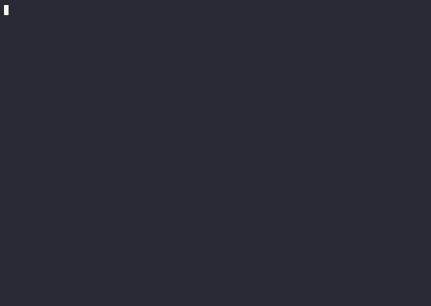

es # tv2 — a CLOS-native kernel for the tvision TUI framework

`tv2` is an experimental, clean-break re-architecture of the framework's
*dispatch and construction* layers. It asks: if we diverged from classic Turbo
Vision and rebuilt on top of CLOS, what would the framework look like?

It is **not** a replacement for the classic [`tvision`](../) system — it lives
alongside it (`tv2` depends on `tvision`) and reuses tvision's terminal driver,
screen/cell buffer, geometry, and the `outline-node` data structure unchanged.
Only the plumbing — state, events, commands, layout, theming, persistence — is
new. Every real tvlisp window has been rebuilt on it as a working demo.

```lisp
(asdf:load-system "tv2")
(tv2:run-desktop)     ; the IDE: a menu bar + status bar + desktop hosting the windows
;; or run a single window full-screen:
(tv2:run-repl)        ; run-editor, run-project, run-html, run-threadmon, run-packages, …
```

The IDE shell — a Turbo-Vision-style **menu bar**, **status bar**, and a desktop
that hosts the ported windows (REPL with the SLDB debugger, the syntax-
highlighting editor, the git project tree, the HTML browser with find-in-page):



## What's different from classic Turbo Vision

| Concern | Classic tvision | tv2 |
| --- | --- | --- |
| Redraw | call `draw-view` after mutating | a **reactive metaclass** invalidates the screen on any slot write |
| Events | integer `+ev-*+` type tags, `cond` on type | **CLOS event classes** dispatched by multimethods `(view × event)` |
| Commands | 138 integer `+cm-*+` constants + a central dispatch `cond` | **named command objects** resolved through layered **keymaps** → `perform` |
| Layout | hand-computed `TRect` bounds | a **box-model DSL** (`stack`/`row` with `:fill`/integer sizes) via the `ui` macro |
| Colours | byte palettes walked up the owner chain | **named roles** resolved through `*theme*` |
| Modal result | boolean `Valid` + error flags | dialogs that **return values**; validation via **conditions/restarts** |
| Persistence | `TStream` `read`/`write` methods | **MOP-based** `serialize`/`deserialize` with a `:transient` slot option |
| Background work | — | a **worker→UI bridge** (`run-on-ui`/`drain-ui-callbacks`): only the UI thread touches the screen |

## Kernel layers (load order)

- **`kernel.lisp`** — the `reactive-class` metaclass (`(setf slot-value-using-class) :after` → `invalidate`); the `view` base class; geometry helpers; the event class hierarchy and `translate` (tvision event → tv2 event); `keymap`/`defkeymap`/`keymap-lookup`; `command`/`define-command`/`perform`; drawing helpers; `*theme*`/`role`; the `container` protocol (focus routing, Tab cycling, event bubbling).
- **`runtime.lisp`** — the `persistent-class` metaclass + `:transient` slots, `serialize`/`deserialize`/`save-object`/`load-object`, the `session` object, and the worker→UI bridge.
- **`outline.lisp`** — the `outline` tree view (reuses tvision `outline-node`, supports lazy children).
- **`widgets.lisp`** — `window`, `button`, `static-text`, `input-line`, `list-box`.
- **`scrollback.lisp`** — an append-only, auto-following, scrollable transcript view.
- **`layout.lisp`** — the `stack`/`row` layout containers and the compile-time-checked `ui` construction macro.
- **`modal.lisp`** — value-returning `dialog`s and `exec-view` (the modal loop), with conditions/restarts for validation.
- **`syntax.lisp`** — pluggable colorizers for the editor (`lisp-colorize`).
- **`debugger.lisp`** — an SLDB-style restart picker with a live backtrace, per-frame locals, and return-from-frame.

## Building views — the `ui` macro

Structure is checked at macroexpansion; sizes are `:fill` or integers:

```lisp
(ui (window (:title " Demo " :keymap *global-keys*)
      (stack
        (1     (row (9 (static-text :role :label :text " Filter: "))
                    (:fill (input-line :name 'find :on-change #'my-handler))))
        (:fill (outline :name 'tree :roots (demo-roots) :keymap *outline-keys*))
        (1     (row (16 (button :label "Collapse all" :command 'collapse-all))
                    (8  (button :label "Quit"         :command 'quit))
                    (:fill (static-text :name 'echo :role :status :text "")))))))
```

Behaviour is data: keys map to named commands, commands are methods on the
command name, and views react to state changes automatically.

```lisp
(defkeymap *outline-keys* (*global-keys*)
  (:up cursor-up) (:down cursor-down) (:enter activate) (:right activate) (:left collapse))

(define-command cursor-down (v e) (ov-move v 1))
```

## The ported windows (real tvlisp windows, rebuilt on tv2)

Each is built entirely from tv2 parts and verified by driving the built program
through a pty. Entry points:

| Entry point | What it is |
| --- | --- |
| `run` | the kitchen-sink demo (outline + list + input + buttons + a `go-to-line` modal + session persistence + a background clock through the bridge) |
| `run-threadmon` | thread monitor — live `sb-thread` list, spawn/kill, background refresh via `run-on-ui` |
| `run-project` | project manager — a `git ls-files` tree with lazy directories and a flatten-on-filter input |
| `run-packages` / `run-systems` / `run-browser` | the filterable picker family (Packages, ASDF systems, …) — one generic `run-browser` |
| `run-repl` | the Lisp listener — worker-thread eval, live output streaming (a Gray stream), history vars, sticky `in-package`, command history, and the SLDB debugger on error |
| `run-editor` | the text editor — vector-of-lines model, selection, clipboard, undo/redo, file I/O, Lisp syntax highlighting, and opt-in soft word-wrap (`C-w`) |
| `run-html` | the HTML browser — tvlisp's tokenizer + layout reused verbatim; styled runs, link navigation, in-document anchors, and find-in-page (`/`, `<`/`>`) |

## Status & non-goals

tv2 is a research kernel: it demonstrates the architecture end-to-end, not a
hardened release.  **Mouse** is supported — clicks hit-test the view tree to
focus/select/press (menus, rows, buttons, links, caret placement) and the wheel
scrolls the view under the pointer.  The desktop is a real window manager:
**movable / resizable / overlapping windows** (drag the title to move, the ◢ grip
to resize, `[✕]` to close; the Window menu tiles/cascades).  Scrollable windows
draw a **scrollbar** on the right frame edge (click the arrows/track or drag the
thumb).  The bottom **status bar** shows clickable, context-sensitive chips —
window actions plus the focused widget's own `status-hints`.  Checkbox and radio
**cluster** controls are available (Space or click toggles; see the Options
window).  Standard **dialogs** are there too: a file picker and change-dir (File
menu) and a live colour customiser that edits `*theme*` with instant preview.
**F1** (or the Help menu) opens context-sensitive help for the focused window,
rendered with the HTML view and cross-linked between topics.  The editor also has
incremental **find** (Find/Next chips), **auto-indent**, and **mouse drag-select**.
The menu bar has **Alt-hotkeys** (the highlighted letter), global **accelerators**
(e.g. `^O` Open, `^Q` Exit, `^R` REPL), and dimmed disabled items.  A **table
viewer** (columns + fixed header + scrollbar; see the Package-table window) is
available.  Still deferred relative to the classic `tvision` system: nested
submenus, regex search & replace, input validators, and a history dropdown.
